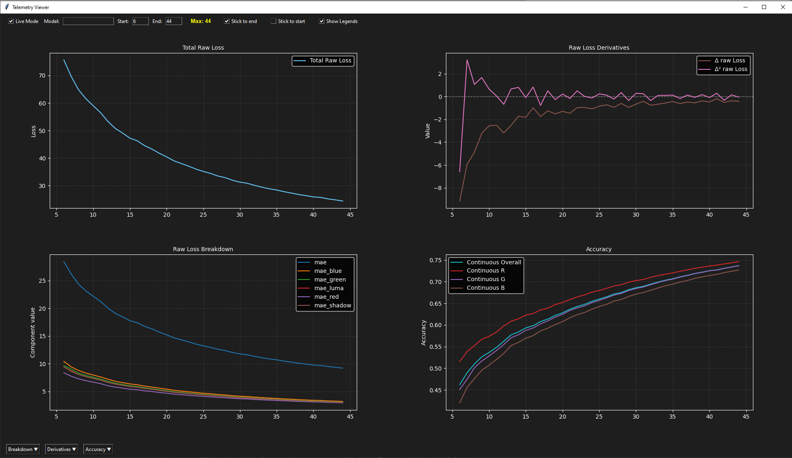
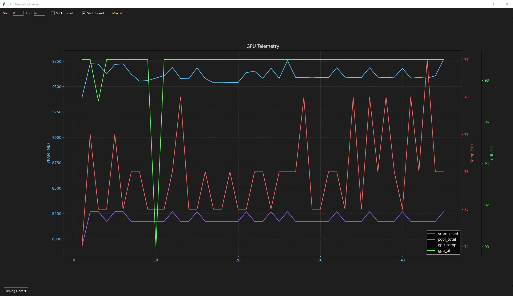
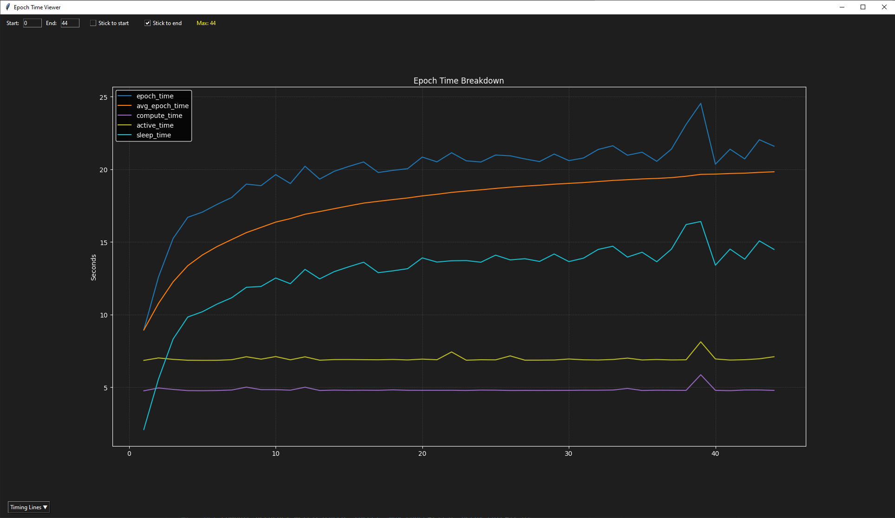
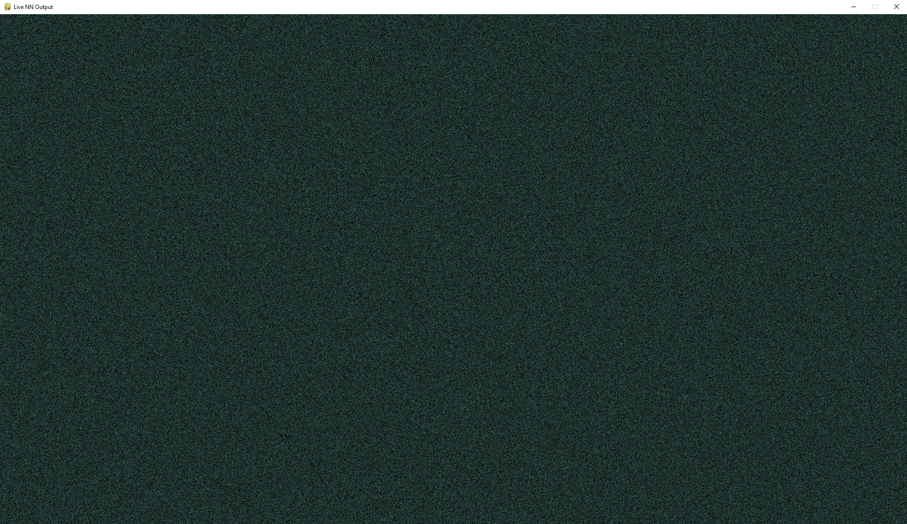

# Procedural-Input Neural Network (CuPy-Accelerated)

## Overview
A fully custom neural network implemented from scratch using CuPy for GPU‑accelerated computation. 
The model learns to generate images from procedural inputs (radial fields, noise patterns, checkerboards, etc.) without datasets or external ML frameworks. 
The system is designed for clarity, interpretability, and controlled experimentation, with a modular loss system, deterministic inputs, and real‑time telemetry for analysing optimisation behaviour. 
This project demonstrates GPU programming, custom backpropagation, procedural input design, and live visualisation tooling, all built without PyTorch or TensorFlow. 

This project avoids datasets entirely, using procedural inputs to keep training deterministic, controllable, and lightweight enough for a single 2080 Ti.

## Visual Showcase

### Training Metrics
Tracks loss, derivatives, and accuracy over training, showing how the model stabilises and improves.

### GPU Metrics
Real‑time GPU temperature, utilisation, and VRAM usage during training.

### Epoch Time Metrics
Breakdown of compute, active, and sleep time per epoch, showing training loop performance.

### Live Image Display
Live output from the model during training.

## Running The Project
This project can be run in two ways:
- Local install with venv - (recommended) required for displays, viewers, and any GUI windows
- Docker - usable for training

Both methods are explained below.

### Option 1 - Local Install With Virtual Environment (Required for Displays)

If you want to use the live image display or telemetry viewers, you must run the project locally. 
A python virtual environment is the recommended way to do this.

**1. Create and activate a virtual environment** 
	`python -m venv venv` 
	`source venv/bin/activate	# Linux  / macOS` 
	`venv\Scripts\activate		# Windows` 

**2. Install all dependencies** 
	`pip install -r requirements.txt` 

This installs:
- CuPy (GPU acceleration)
- Numpy
- pandas
- Pillow
- pygame
- matplotlib

  __3. Run the training script__  
	`python main.py` 

This will:
- start training
- write telemetry files

 __4. Run the telemetry viewers__ 
the different telemetry/image viewers include:
- viewer_pygame.pyw
- loss_telemetry.pyw
- optimiser_telemetry.pyw

 

### Option 2 - Docker (Training Only)

Docker provides a fully configured environment with the correct CuPy + CUDA setup and all required libraries for training.

__Build the image__ 
`docker build -t Clean-Neural-Net`
  
__Run the container__ 
`docker run --gpus all Clean-Neural-Net`

This will start the training process inside a controlled GPU-enabled environment.  

__Important__ 

Docker is used __only for training.__ 
The live image display, telemetry viewer, or any GUI windows __should not be run inside Docker__, 
because containers do not have access to your system's display server by default. 

If you want to see the live image or telemetry graphs, run those scripts locally.

 

### Entry Points
- main.py -> starts training
- viewer_pygame.pyw -> starts the live image viewer
- loss_telemetry.pyw -> starts the live network loss telemetry viewer
- epoch_time_telemetry.pyw -> graphs the time epochs take along with the breakdown of where that time is spent
- gpu_telemetry.pyw -> graphs the gpu temp, utilisation, and VRAM usage
- optimiser_telemetry.pyw -> starts the live optimiser telemetry viewer (NOTE: only viable with some specific optimisers that have logging built into them.)

- Config/config.py -> contains various settings for tweaking the model.
- Config/Inputs/layers_config.py -> contains a list of all procedural inputs the model is using (NOTE: there can be duplicates without issue)

 

## Key Features

- GPU-accelerated neural network using CuPy
- Procedural input pipeline (no datasets required, only training images)
- Custom forward and backward pass
- Modular loss system
- File-based telemetry
	- JSON for loss and optimisation metrics
	- NPY for live image data
- Live image display showing training progression
- Deterministic network configuration and procedural inputs for reproducible runs
- Docker environment for consistent training setup

## Architecture Overview

The system consists of three main components:
 

### 1. Procedural Input Generator
Generates deterministic synthetic inputs for each pixel. 
This provides a controlled environment for studying optimisation behaviour.
 

### 2. Feedforward Neural Network
A simple MLP implemented entirely by hand: 
- custom forward pass
- custom backward pass
- custom weight updates
- CuPy arrays for GPU acceleration

### 3. Telemetry and Visualisation
Training writes metrics to disk each epoch:
- `Telemetry/telemetry_logs/nn_model.jsonl` for loss data
- `Telemetry/telemetry_logs/nn_model_optimiser.jsonl` for optimiser data
- `outputs/latest_frame.npy` for current output image
A viewer script loads these files to display:
- loss curves
- optimisation behaviour
- the most recent output image generated

## Skills Demonstrated
- GPU programming with CuPy
- From-scratch neural network implementation
- Custom optimisation and backpropagation
- Procedural input generation
- Real-time visualisation and telemetry
- Docker environment setup
- Modular Programming

## Project Purpose
This project is part of ongoing research into:
- procedural input representations
- optimisation behaviour
- interpretable training dynamics
The goal is clarity, control, and experimentation rather than production-grade image generation.

