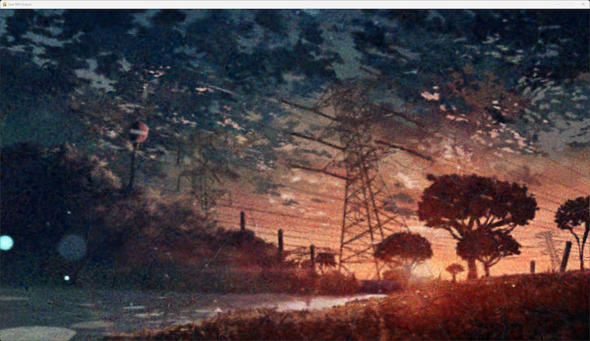
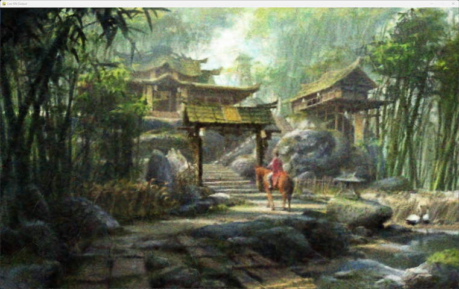
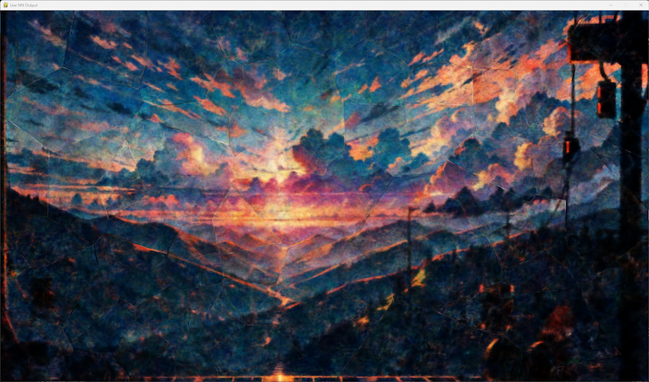
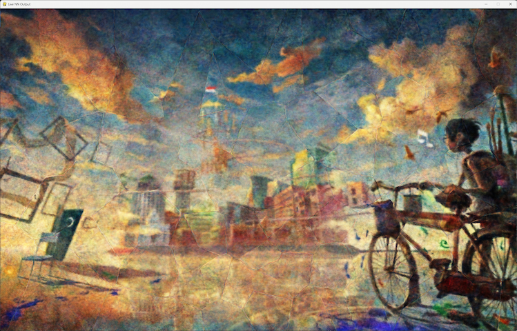

# Multi-Image Learning Capability

## Overview

This document describes the model’s ability to maintain and learn multiple high‑resolution image representations within a single set of weights.
All outputs shown here were generated at epoch 1496, with only the display target switched between captures.

The original training images are not included due to uncertain licensing.

## Training Setup

### Training Images

- A total of 4 __training images__ were used.
- All images were __approximately 1080p__, but __not identical in resolution__.
- Each image was used at its native resolution __without__ resizing to a uniform size.

### Pairwise Training Scheme

Training is performed on __2 images at a time__, selected from the pool of 4.

This produces __6 unique image pairs__:

1. Image A + Image B
2. Image A + Image C
3. Image A + Image D
4. Image B + Image C
5. Image B + Image D
6. Image C + Image D

### Pair Selection Method

Pair selection is __not__ performed in a fixed rotation or predetermined order.

Instead:

- A __seeded random number generator__ selects which pair is used at each training step.
- Because the RNG is seeded, the sequence of pairs is __fully deterministic__ and reproducible.
- Over time, all 6 possible pairs are sampled repeatedly.

This ensures that all images contribute to the shared representation while maintaining deterministic behaviour.

### Training Duration

- The results shown were obtained at __epoch 1496__.
- At this point, all four images were __recognisably reconstructed__ by the model.

## Same-Epoch Outputs

All outputs shown below were produced by:

- __loading the exact same saved model state__ from epoch 1496.
- switching only the __display target__ between captures.
- performing __no additional training__ between outputs.

This demonstrates that the model holds __all four image representations simultaneously__ within a single set of weights.

## Results

Below are the four outputs produced at the same epoch.
 
Each corresponds to one of the four training images.

---

### Note on Screenshot Resolution

The screenshots shown in this document have been __downscaled__ to display cleanly in markdown.

- The model __did not__ generate the images at the downscaled resolution.
- All outputs were originally generated at __approximately 1080p__, matching the native resolution of each training image.
- Only the documentation copies have been resized.

The full-resolution outputs can be reproduced by running the model at the same epoch.

---

### Interpretation

These results demonstrate that:

- The model can __store multiple high-resolution image representations__ in a single set of weights.
- The model can train on __deterministically sampled 2-image subsets__ while still maintaining stable representation for all 4 images.
- The model successfully reconstructs images of __slightly different resolutions__, indicating that uniform input size is not required.
- At epoch 1496, all four outputs show __consistent global structure__ and __recognisable content__, indicating that the model is learning them __simultaneously__, not sequentially.

This behaviour represents the current, demonstrated capability of the architecture.

## How to Inspect a Learned Image

To visually verify how well the model is reproducing a specific target image, set the following configuration values in `Config/config.py`:

`ENABLE_END_VIEWER = True`
 
`FORCE_NEW_MODEL = False`
 
`TRAIN = False`

Then set the following parameters in `Config/config.py`:

- __HELDOUT_SEED__
 
Set this to the seed associated with the target image you want to inspect.
 
This value is stored in:
 
`Config/image_registry.json`

- __HEIGHT__ and __WIDTH__
 
Set these to the __exact pixel dimensions__ of the target image.

### Procedure

- Train the model normally on your chosen set of 4+ images.
- When you want to inspect reconstruction, update the config values above.
- Set `HELDOUT_SEED` to the seed for the image you want to inspect.
- Set `HEIGHT` and `WIDTH` to that image's native resolution.
- Run the program.

Because training is disabled, the end viewer will open immediately and display the model's reconstruction of the selected image.