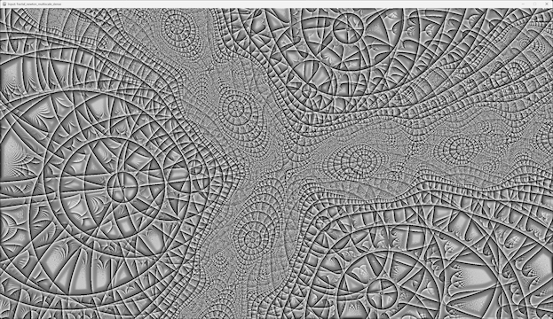
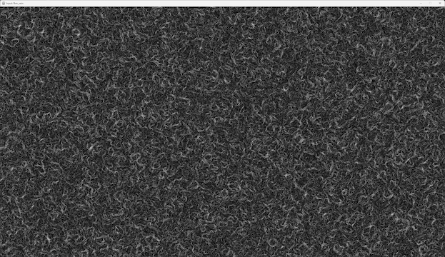

# Procedural Inputs

Procedural inputs are the synthetic signals the model learns from.
Each input is a 2D field generated algorithmically — no datasets, no coordinates, no positional encodings.
These fields form the entire input space the model uses to generate an image.

Every procedural input is:

- deterministic — the same seed always produces the same field

- independent — each input is treated as its own standalone signal

- structural — patterns, gradients, noise fields, and other algorithmic textures

- interpretable — you can visually inspect them to understand what the model sees

The model never receives raw image pixels.
It only receives patches extracted from these procedural fields.

## Examples of Procedural Inputs

Below are a couple of examples to illustrate the kinds of fields the model uses during training.
These images are intentionally downscaled — they’re meant to show the structure, not the fine detail.

These examples demonstrate the variety of patterns the model learns to interpret and combine.

## What the Model Actually Sees: Patches

The model does not consume the full procedural input maps directly.
Instead, for each pixel it generates, it receives a patch from every procedural input.

The patch size is fully configurable.
In practice, what I tend to work with is a 7×7 patch, as it provides a good balance between local structure and input dimensionality.

Here’s a conceptual illustration of what a patch is:

A patch is simply a small window cropped from each procedural input field.

## How Patches Become Model Inputs

For every pixel the model outputs:

- A patch is extracted from each procedural input

- Each patch is flattened into a vector

- All vectors are concatenated into one large input vector

- That vector is fed into the model to generate a single pixel

Because the patch size is configurable, the dimensionality of the input vector scales with it.

Example:

If the model uses 5 procedural inputs and the patch size is 7×7:

- each patch contains 7×7=49 values

- there are 5 such patches

- all patches are flattened and concatenated

So the final input vector has: 49×5=245 values

## Why This Matters

Because the model learns exclusively from these procedural fields:

- its generalisation behaviour is interpretable

- its inductive biases are explicit

- experiments are reproducible

- training dynamics can be studied cleanly

Procedural inputs define the “world” the model learns to understand.